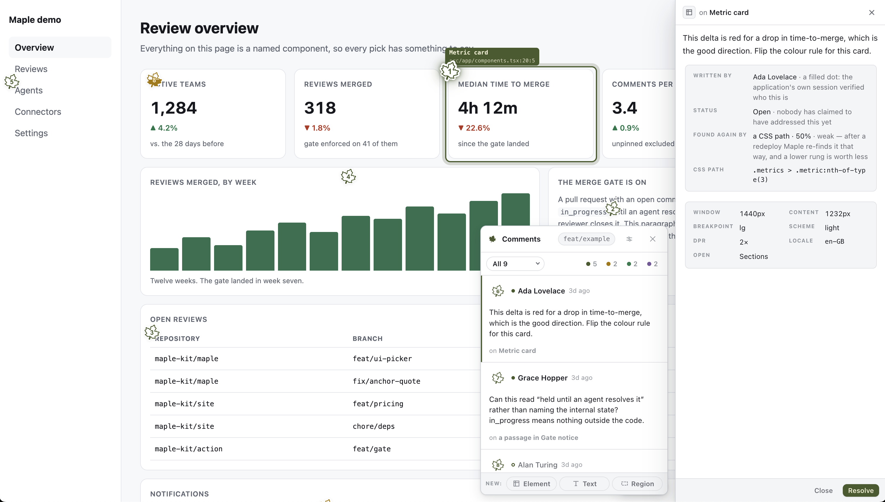

<picture>
  <source media="(prefers-color-scheme: dark)" srcset="docs/assets/wordmark-dark.svg">
  
</picture>

### [Introducing Maple →](https://blog.nitzan.fyi/introducing-maple) · [maple-kit.org](https://maple-kit.org)

Visual review comments on deployed previews, written for people and read by
agents.



> [!TIP]
> That is **[maple-kit.org](https://maple-kit.org)** reviewing its own preview
> deployment. The site is the fastest way to see what Maple does;
> **[the intro post](https://blog.nitzan.fyi/introducing-maple)** says why it
> exists and what already works.

A reviewer points at something on a preview deployment and says what is wrong.
Maple captures where they pointed, what they were looking at and who they are,
hands it to a coding agent in a form it can act on, and holds the merge until
every comment is resolved.

**Status: 0.x.** All six packages are published, with provenance, through a
trusted publisher. 0.x makes no compatibility promise: a public interface is
broken when breaking it is the right shape, and the changeset says what broke.

## Why another one

Pincushion, Vercel Toolbar, Chromatic, BugHerd and Marker.io each do some of
this. None combines all four of:

- **Open source**, Apache-2.0, with no hosted service required.
- **Deployed previews.** Maple runs on the preview URL your CI already builds,
  so anyone with the link can comment — a designer, a product manager, a client.
  Tools like Agentation run against `localhost`, which means the only person who
  can leave a comment is the person running the build.
- **A merge gate** — CI blocks while a visual comment is unresolved, and
  optionally until somebody says they looked. See [`docs/gate.md`](docs/gate.md).
- **An agent loop** — the agent reads comments, fixes, and resolves them.

## Vendor-agnostic by construction

Maple stores nothing itself. A connector is one file implementing plain
Promise-returning methods:

```ts
import type { StoreConnector } from "@maple-kit/core/connectors";

export function myStore(options: MyOptions): StoreConnector {
  return {
    name: "my-store",
    async list(query) {
      /* … */
    },
    async append(comment) {
      /* … */
    },
  };
}
```

There are six kinds — store, media, observability, identity, gate and
classifier — and a connector's capabilities are exactly the methods it defines.
Run `maple connectors` to print the matrix from the code, or see
[`docs/connectors.md`](docs/connectors.md).

## Packages

| Package                 | What it is                                              |
| ----------------------- | ------------------------------------------------------- |
| `@maple-kit/core`       | Server SDK, overlay controller and connector contracts. |
| `@maple-kit/react`      | Hooks over the controller. No styles, no components.    |
| `@maple-kit/ui`         | The marks, the island and the composer.                 |
| `@maple-kit/cli`        | The `maple` command.                                    |
| `@maple-kit/mcp`        | The MCP server an agent talks to.                       |
| `@maple-kit/classifier` | Scores a comment as it is written.                      |

## Documentation

- [Connectors and the capability matrix](docs/connectors.md)
- [The JSX tagger](docs/tagger.md) — how a comment becomes `file:line`
- [The overlay and CSP](docs/overlay-csp.md) — what Maple asks of your policy
- [The agent loop](docs/agent-loop.md) — the MCP tools and the Stop hook
- [Drafts and publishing](docs/drafts.md) — why a comment is unsent until it is not
- [The merge gate](docs/gate.md) — what blocks a merge, and what approving does

## See it running

```
nvm use
pnpm install
pnpm --filter @maple-kit/example-vite dev   # http://localhost:5173
```

A real Vite application with three comments already on it: marks on the page,
the island in the corner, and all three picks working against an SDK route the
dev server mounts. [`examples/vite-app`](examples/vite-app) says what it does
and does not prove.

## Development

```
nvm use          # or fnm use, mise install — .nvmrc pins the version
pnpm install
pnpm hooks
pnpm lint && pnpm typecheck && pnpm test
```

Requires Node 24, the active LTS, and pnpm 10. Switch **before** the install:
pnpm 10 and 11 load `node:sqlite`, which Node 23 does not have, so on the wrong
version pnpm crashes rather than telling you the version is wrong. See
[CONTRIBUTING.md](CONTRIBUTING.md).

## Licence

Apache-2.0. Contributions are accepted under the
[Developer Certificate of Origin](DCO) — sign off with `git commit -s`. There is
no CLA.
