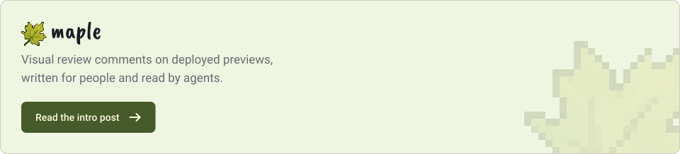
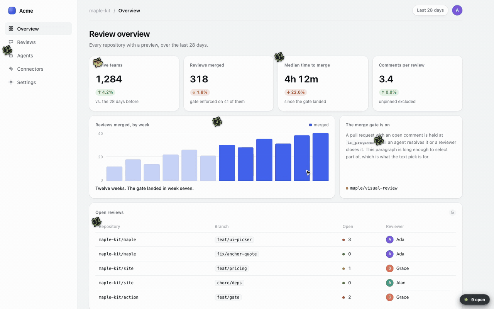
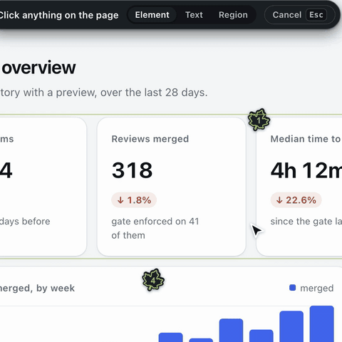
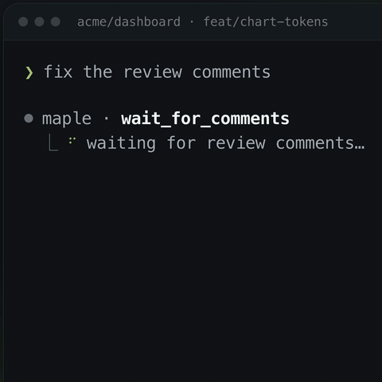
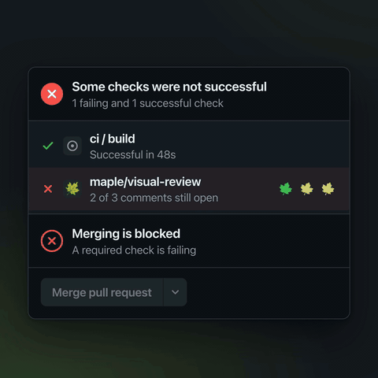
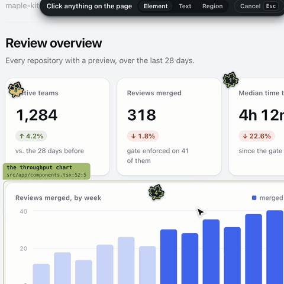
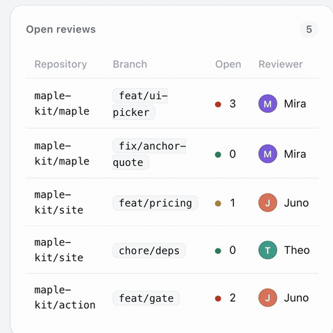
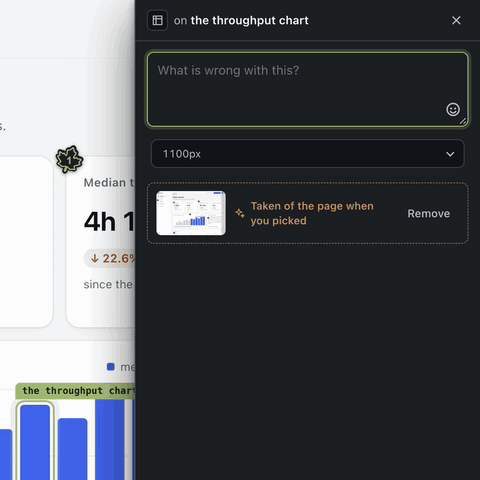

<a href="https://blog.nitzan.fyi/introducing-maple"><picture>
<source media="(prefers-color-scheme: dark)" srcset="docs/assets/card-dark.svg">

</picture></a>

<a href="https://maple-kit.org"></a>
<a href="https://github.com/maple-kit/maple/actions/workflows/ci.yml"></a>
<a href="https://www.npmjs.com/package/@maple-kit/core"></a>
<a href="LICENSE"></a>

<p align="center">
  
  <br>
  <sub><a href="docs/assets/demo.mp4">Watch it as video</a> · recorded from <a href="examples/vite-app">the Vite example</a> by <a href="tools/demo-recorder">tools/demo-recorder</a></sub>
</p>

A reviewer points at something on a preview deployment and says what is wrong.
Maple captures where they pointed, what they were looking at and who they are,
hands it to a coding agent in a form it can act on, and holds the merge until
every comment is resolved.

**Status: 0.x.** All eight packages are published, with provenance, through a
trusted publisher. 0.x makes no compatibility promise: a public interface is
broken when breaking it is the right shape, and the changeset says what broke.

## What it does

<table>
<tr>
<td width="33%" valign="top"><a href="packages/ui"></a><br><b>An element, an area, or a passage.</b> Pick a component, drag a box, or select the words that are wrong. The anchor finds it again after a redeploy.</td>
<td width="33%" valign="top"><a href="packages/mcp"></a><br><b>Your agent picks it up over MCP.</b> It waits for comments, reads each with its context, makes the change, and resolves it against the commit.</td>
<td width="33%" valign="top"><a href="docs/gate.md"></a><br><b>A merge gate.</b> <code>maple/visual-review</code> fails while a comment is open and, if you want, until the reviewer approves.</td>
</tr>
<tr>
<td valign="top"><a href="packages/core"></a><br><b>The file and the line.</b> A build-time tagger marks every JSX element with where it was written, so a comment arrives pointing at source.</td>
<td valign="top"><a href="packages/mock"></a><br><b>Any state, on request.</b> Type empty, failing or a thousand rows, and the page's API calls return it. A model picks the state; code writes every byte.</td>
<td valign="top"><a href="packages/classifier"></a><br><b>A score, if you want one.</b> The comment is judged as it is typed, against five pillars, by a classifier you supply.</td>
</tr>
</table>

Each package's README shows the rest: [the CLI](packages/cli), [the design
lint](packages/lint), [flags and roles in a mock](packages/mock#flags-and-roles)
and [the connectors](packages/core#connectors).

## Why another one

Pincushion, Vercel Toolbar, Chromatic, BugHerd and Marker.io each do some of
this. None combines all four of:

- **Open source**, Apache-2.0, with no hosted service required.
- **Deployed previews.** Maple runs on the preview URL your CI already builds,
  so anyone with the link can comment — a designer, a product manager, a client.
  Tools like Agentation run against `localhost`, which means the only person who
  can leave a comment is the person running the build.
- **A merge gate** — CI blocks while a visual comment is unresolved, and
  optionally until somebody says they looked. See [`docs/gate.md`](docs/gate.md).
- **An agent loop** — the agent reads comments, fixes, and resolves them.

## Add it to an app

```sh
npm install @maple-kit/core @maple-kit/ui
```

Mount the route and the tagger from the build, then render the overlay:

```ts
// vite.config.ts
import { createCommentStore } from "@maple-kit/core";
import { githubStore } from "@maple-kit/core/connectors";
import { maple } from "@maple-kit/core/vite";

const preview = process.env.MAPLE_PREVIEW === "1";

export default defineConfig({
  plugins: [
    react(),
    maple({
      tagger: preview,
      route: {
        store: createCommentStore(
          githubStore({ owner: "acme", repo: "web", token: process.env.GITHUB_TOKEN! }),
        ),
      },
    }),
  ],
});
```

```tsx
// main.tsx
import { Maple } from "@maple-kit/ui/maple";

createRoot(root).render(
  <>
    <App />
    <Maple branch={import.meta.env.VITE_MAPLE_BRANCH} />
  </>,
);
```

Next.js uses `withMaple` from `@maple-kit/core/next` and a catch-all route at
`app/api/maple/[...maple]/route.ts`; [`examples/next-app`](examples/next-app)
has both. The `setup-maple-org` skill walks through the GitHub App a reviewer
signs in with.

## Vendor-agnostic by construction

Maple stores nothing itself. A connector is one file implementing plain
Promise-returning methods:

```ts
import type { StoreConnector } from "@maple-kit/core/connectors";

export function myStore(options: MyOptions): StoreConnector {
  return {
    name: "my-store",
    async list(query) {
      /* … */
    },
    async append(comment) {
      /* … */
    },
  };
}
```

There are six kinds — store, media, observability, identity, gate and
classifier — and a connector's capabilities are exactly the methods it defines.
Run `maple connectors` to print the matrix from the code, or see
[`docs/connectors.md`](docs/connectors.md).

## Packages

| Package                                        | What it is                                                           |
| ---------------------------------------------- | -------------------------------------------------------------------- |
| [`@maple-kit/core`](packages/core)             | Server SDK, overlay controller, connector contracts, build plugins.  |
| [`@maple-kit/ui`](packages/ui)                 | The marks, the island and the composer: the overlay a reviewer uses. |
| [`@maple-kit/react`](packages/react)           | Hooks over the controller, for an overlay in your own design system. |
| [`@maple-kit/mcp`](packages/mcp)               | The MCP server an agent talks to, and a Stop hook.                   |
| [`@maple-kit/cli`](packages/cli)               | The `maple` command.                                                 |
| [`@maple-kit/mock`](packages/mock)             | Rewrites a page's API responses, flags and role into a named state.  |
| [`@maple-kit/classifier`](packages/classifier) | Scores a comment as it is written, and plans a mock from a sentence. |
| [`@maple-kit/lint`](packages/lint)             | Design-system rules read off the page the browser laid out.          |

## Documentation

- [Connectors and the capability matrix](docs/connectors.md)
- [The JSX tagger](docs/tagger.md) — how a comment becomes `file:line`
- [The overlay and CSP](docs/overlay-csp.md) — what Maple asks of your policy
- [The agent loop](docs/agent-loop.md) — the MCP tools and the Stop hook
- [Drafts and publishing](docs/drafts.md) — why a comment is unsent until it is not
- [The merge gate](docs/gate.md) — what blocks a merge, and what approving does
- [Maple Mock](docs/mock.md) — a model picks the state, code writes every byte
- [The assist tier](docs/assist.md) — what a score is, and what it is never allowed to be
- [Design lint](docs/lint.md) — the rendered rules and the tiers around them

## See it running

```
nvm use
pnpm install
pnpm --filter @maple-kit/example-vite dev   # http://localhost:5173
```

A real Vite application with three comments already on it: marks on the page,
the island in the corner, and all three picks working against an SDK route the
dev server mounts. [`examples/vite-app`](examples/vite-app) says what it does
and does not prove.

## Development

```
nvm use          # or fnm use, mise install — .nvmrc pins the version
pnpm install
pnpm hooks
pnpm lint && pnpm typecheck && pnpm test
```

Requires Node 24, the active LTS, and pnpm 10. Switch **before** the install:
pnpm 10 and 11 load `node:sqlite`, which Node 23 does not have, so on the wrong
version pnpm crashes rather than telling you the version is wrong. See
[CONTRIBUTING.md](CONTRIBUTING.md).

## Licence

Apache-2.0. Contributions are accepted under the
[Developer Certificate of Origin](DCO) — sign off with `git commit -s`. There is
no CLA.
