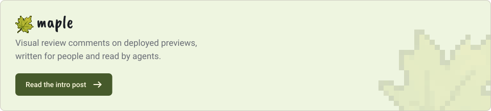
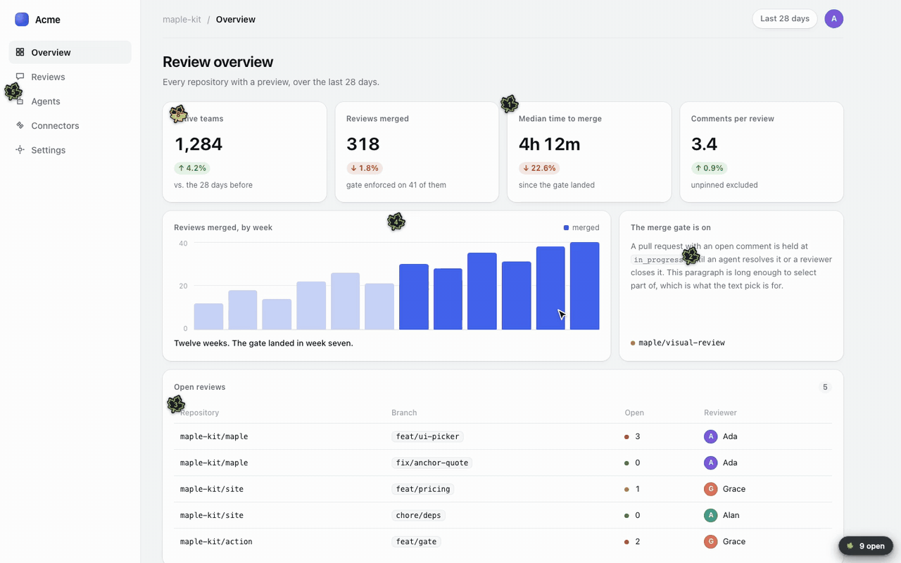
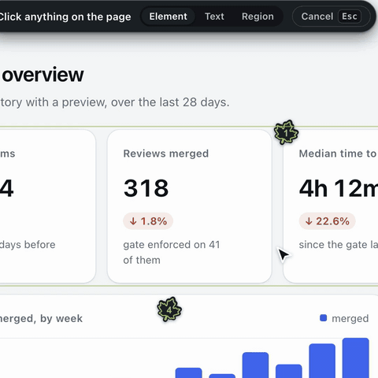
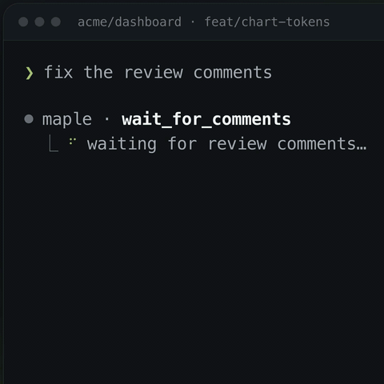
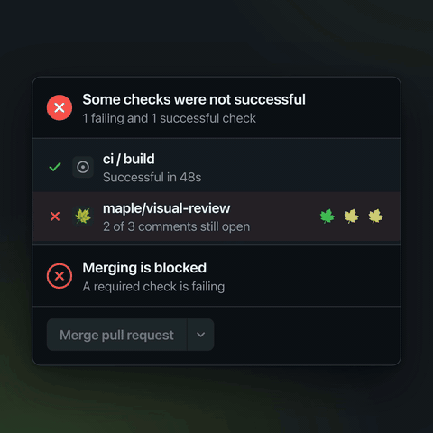
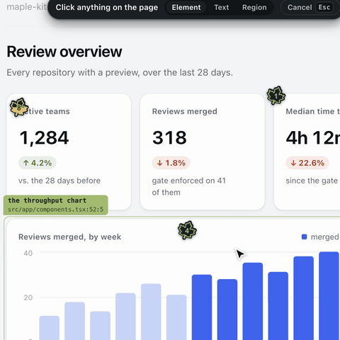
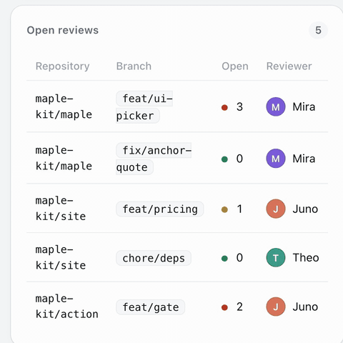
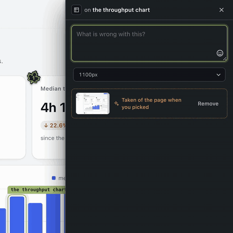

<p align="center"><a href="https://blog.nitzan.fyi/introducing-maple"><picture>
<source media="(prefers-color-scheme: dark)" srcset="docs/assets/card-dark.svg">

</picture></a></p>

<p align="center"><b><a href="https://maple-kit.org">maple-kit.org</a></b> · <a href="https://blog.nitzan.fyi/introducing-maple">Intro post</a> · <a href="#documentation">Docs</a> · <a href="https://www.npmjs.com/org/maple-kit">npm</a></p>

<a href="https://maple-kit.org"></a>
<a href="https://github.com/maple-kit/maple/actions/workflows/ci.yml"></a>
<a href="https://www.npmjs.com/package/@maple-kit/core"></a>
<a href="LICENSE"></a>

<p align="center">
  
  <br>
  <sub><a href="docs/assets/demo.mp4">Watch it as video</a> · recorded from <a href="examples/vite-app">the Vite example</a> by <a href="tools/demo-recorder">tools/demo-recorder</a></sub>
</p>

A reviewer points at something on a preview deployment and says what is wrong.
Maple captures where they pointed, what they were looking at and who they are,
hands it to a coding agent in a form it can act on, and holds the merge until
every comment is resolved.

**Status: 0.x.** All eight packages are published, with provenance, through a
trusted publisher. 0.x makes no compatibility promise: a public interface is
broken when breaking it is the right shape, and the changeset says what broke.

## How it works

<p align="center"><picture>
<source media="(prefers-color-scheme: dark)" srcset="docs/assets/how-it-works-dark.svg">

</picture></p>

<table>
<tr>
<td width="25%" valign="top"><b><a href="docs/configuration.md">Mount</a></b><br>One route in your application, and one script in the preview build.</td>
<td width="25%" valign="top"><b><a href="docs/github-auth.md">Comment</a></b><br>A reviewer points to an issue on the app. Maple records all the context needed for the agent to pick it up.</td>
<td width="25%" valign="top"><b><a href="docs/agent-loop.md">Fix</a></b><br>Your agent monitors new comments via the MCP, implements a fix and marks it as resolved.</td>
<td width="25%" valign="top"><b><a href="docs/gate.md">Gate</a></b><br>A CI check holds the merge until all comments are resolved, and all visual gates pass.</td>
</tr>
</table>

Code got fast. Planning, definitions of done and edge cases did not, so they get
skipped and surface in testing. Maple moves that review to the preview, where
the comment can still be acted on.

## What it does

<table>
<tr>
<td width="33%" valign="top"><a href="packages/ui"></a><br><b>An element, an area, or a passage.</b> Pick a component, drag a box, or select the words that are wrong. The anchor finds it again after a redeploy.</td>
<td width="33%" valign="top"><a href="packages/mcp"></a><br><b>Your agent picks it up over MCP.</b> It waits for comments, reads each with its context, makes the change, and resolves it against the commit.</td>
<td width="33%" valign="top"><a href="docs/gate.md"></a><br><b>A merge gate.</b> <code>maple/visual-review</code> fails while a comment is open and, if you want, until the reviewer approves.</td>
</tr>
<tr>
<td valign="top"><a href="packages/core"></a><br><b>The file and the line.</b> A build-time tagger marks every JSX element with where it was written, so a comment arrives pointing at source.</td>
<td valign="top"><a href="packages/mock"></a><br><b>Any state, on request.</b> Type empty, failing or a thousand rows, and the page's API calls return it. A model picks the state; code writes every byte.</td>
<td valign="top"><a href="packages/classifier"></a><br><b>A score, if you want one.</b> The comment is judged as it is typed, against five pillars, by a classifier you supply.</td>
</tr>
</table>

Each package's README shows the rest: [the CLI](packages/cli), [the design
lint](packages/lint), [flags and roles in a mock](packages/mock#flags-and-roles)
and [the connectors](packages/core#connectors).

## Why another one

Pincushion, Vercel Toolbar, Chromatic, BugHerd and Marker.io each do some of
this. None combines all four of:

- **Open source**, Apache-2.0, with no hosted service required.
- **Deployed previews.** Maple runs on the preview URL your CI already builds,
  so anyone with the link can comment — a designer, a product manager, a client.
  Tools like Agentation run against `localhost`, which means the only person who
  can leave a comment is the person running the build.
- **A merge gate** — CI blocks while a visual comment is unresolved, and
  optionally until somebody says they looked. See [`docs/gate.md`](docs/gate.md).
- **An agent loop** — the agent reads comments, fixes, and resolves them.

## Pick a setup

The SDK route's `store` has no default: without one, the comment endpoints
answer 404. These are the shapes that work, smallest first.

| I want to…                            | Do this                                                                                                                                                                                                               | Read                                                                                                                                                               |
| ------------------------------------- | --------------------------------------------------------------------------------------------------------------------------------------------------------------------------------------------------------------------- | ------------------------------------------------------------------------------------------------------------------------------------------------------------------ |
| Try it locally, with no accounts      | `maple review` proxies your running app and stores comments as files in `.maple/<branch-slug>/comments.json`.                                                                                                         | [`docs/review.md`](docs/review.md), [`packages/cli`](packages/cli)                                                                                                 |
| Review a deployed preview alone       | `maple solo <preview-url>`, or the agent's `start_solo` tool. Comments go to your machine through a loopback bridge. A guest's comments cannot gate a merge.                                                          | [`docs/solo.md`](docs/solo.md)                                                                                                                                     |
| Review a shared preview as a team     | GitHub, one token per reviewer through Device Flow. `npx @maple-kit/cli setup app --owner=acme`, then `maple setup verify --client-id=<Iv…>`. Set `MAPLE_GITHUB_CLIENT_ID`, `MAPLE_COOKIE_KEY` and `MAPLE_PREVIEW=1`. | [`docs/github-auth.md`](docs/github-auth.md), [`docs/configuration.md`](docs/configuration.md), [`setup-maple-org`](plugins/maple/skills/setup-maple-org/SKILL.md) |
| Let an agent act on the comments      | Add the MCP server and the Stop hook, or install the Claude Code plugin.                                                                                                                                              | [`docs/agent-loop.md`](docs/agent-loop.md), [`packages/mcp`](packages/mcp), [`setup-maple-agent-loop`](plugins/maple/skills/setup-maple-agent-loop/SKILL.md)       |
| Block the merge until it is reviewed  | `maple setup ci --require-approval --write` adds the workflow; require the `maple/visual-review` check in a ruleset.                                                                                                  | [`docs/gate.md`](docs/gate.md)                                                                                                                                     |
| Review empty, failing and huge states | `@maple-kit/mock` rewrites the page's API responses into the state a reviewer names.                                                                                                                                  | [`docs/mock.md`](docs/mock.md), [`packages/mock`](packages/mock)                                                                                                   |
| Use your own backend                  | Implement a connector; `maple connectors` prints what each one supports.                                                                                                                                              | [`docs/connectors.md`](docs/connectors.md), [`contribute-connector`](.claude/skills/contribute-connector/SKILL.md)                                                 |

There is no self-hosted shared store yet: a file store in a preview pod loses
its comments with the pod. Until one lands, a team shares GitHub, or writes a
[connector](docs/connectors.md).

## Add it to an app

The quickest wiring, for trying Maple on your own machine. Sharing a preview
needs a store per reviewer: see [Pick a setup](#pick-a-setup).

```sh
npm install @maple-kit/core @maple-kit/ui @babel/core
```

`@babel/core` is an optional peer, and the tagger is what needs it: leave it out
and `tagger: true` has nothing to transform with.

Mount the route and the tagger from the build, then render the overlay:

```ts
// vite.config.ts
import { createCommentStore } from "@maple-kit/core";
import { githubStore } from "@maple-kit/core/connectors";
import { maple } from "@maple-kit/core/vite";

const preview = process.env.MAPLE_PREVIEW === "1";

export default defineConfig({
  plugins: [
    react(),
    maple({
      tagger: preview,
      route: {
        // Local trial only: every comment is written as this one token.
        // The route has no default store; without one its comment endpoints 404.
        store: createCommentStore(
          githubStore({ owner: "acme", repo: "web", token: process.env.GITHUB_TOKEN! }),
        ),
      },
    }),
  ],
});
```

```tsx
// main.tsx
import { Maple } from "@maple-kit/ui/maple";

createRoot(root).render(
  <>
    <App />
    <Maple branch={import.meta.env.VITE_MAPLE_BRANCH} />
  </>,
);
```

The shared `GITHUB_TOKEN` is **for a local trial only**. A preview other people
review builds the store per request from each reviewer's own token, through the
resolver in [`docs/github-auth.md`](docs/github-auth.md), so a comment is
authored by whoever wrote it and no GitHub secret sits in the preview.

Next.js uses `withMaple` from `@maple-kit/core/next` and a catch-all route at
`app/api/maple/[...maple]/route.ts`; [`examples/next-app`](examples/next-app)
has both. The `setup-maple-org` skill walks through the GitHub App a reviewer
signs in with.

## Use with Claude Code

The Maple plugin bundles the skills that set Maple up and act on its
comments, the MCP server that reads and resolves them, and the Stop hook that
keeps an agent working while they are open:

```
/plugin marketplace add maple-kit/maple
/plugin install maple@maple-kit
```

The server and the hook read `GITHUB_TOKEN`, `MAPLE_GITHUB_OWNER` and
`MAPLE_GITHUB_REPO` from the environment Claude Code starts in. In a project
where the last two are unset, the hook lets every stop through.

## Vendor-agnostic by construction

Maple stores nothing itself. A connector is one file implementing plain
Promise-returning methods:

```ts
import type { StoreConnector } from "@maple-kit/core/connectors";

export function myStore(options: MyOptions): StoreConnector {
  return {
    name: "my-store",
    async list(query) {
      /* … */
    },
    async append(comment) {
      /* … */
    },
  };
}
```

There are six kinds — store, media, observability, identity, gate and
classifier — and a connector's capabilities are exactly the methods it defines.
Run `maple connectors` to print the matrix from the code, or see
[`docs/connectors.md`](docs/connectors.md).

## Packages

| Package                                        | What it is                                                           |
| ---------------------------------------------- | -------------------------------------------------------------------- |
| [`@maple-kit/core`](packages/core)             | Server SDK, overlay controller, connector contracts, build plugins.  |
| [`@maple-kit/ui`](packages/ui)                 | The marks, the island and the composer: the overlay a reviewer uses. |
| [`@maple-kit/react`](packages/react)           | Hooks over the controller, for an overlay in your own design system. |
| [`@maple-kit/mcp`](packages/mcp)               | The MCP server an agent talks to, and a Stop hook.                   |
| [`@maple-kit/cli`](packages/cli)               | The `maple` command.                                                 |
| [`@maple-kit/mock`](packages/mock)             | Rewrites a page's API responses, flags and role into a named state.  |
| [`@maple-kit/classifier`](packages/classifier) | Scores a comment as it is written, and plans a mock from a sentence. |
| [`@maple-kit/lint`](packages/lint)             | Design-system rules read off the page the browser laid out.          |

## Documentation

<details open>
<summary><b>Getting started</b></summary>

- [`maple review`](docs/review.md): the overlay on a running app, nothing wired in
- [Configuration](docs/configuration.md): every environment variable, and which are secrets
- [Examples: Vite](examples/vite-app/README.md) and [Next](examples/next-app/README.md): real applications Maple mounts into
- [The CLI](packages/cli/README.md): `review`, `solo`, `setup`, `connectors`, `mock plan`

</details>

<details>
<summary><b>Reviewing</b></summary>

- [Solo mode](docs/solo.md): a guest's comments on their own machine
- [Drafts and publishing](docs/drafts.md): why a comment is unsent until it is not
- [The JSX tagger](docs/tagger.md): how a comment becomes `file:line`
- [Anchoring a region](docs/regions.md): how a dragged box finds its content again
- [Screenshots](docs/screenshots.md): the picture taken at pick time
- [Replies](docs/replies.md): decided, not built

</details>

<details>
<summary><b>Agent loop</b></summary>

- [The agent loop](docs/agent-loop.md): the MCP tools and the Stop hook
- [`@maple-kit/mcp`](packages/mcp/README.md): the server and the hook
- [`setup-maple-agent-loop`](plugins/maple/skills/setup-maple-agent-loop/SKILL.md): connect and verify an agent
- [`maple-review`](plugins/maple/skills/maple-review/SKILL.md): turn a pull request's comments into a worklist

</details>

<details>
<summary><b>Merge gate</b></summary>

- [The merge gate](docs/gate.md): what blocks a merge, what approving does, which App to pin

</details>

<details>
<summary><b>States and scoring</b></summary>

- [Maple Mock](docs/mock.md): a model picks the state, code writes every byte
- [`@maple-kit/mock`](packages/mock/README.md): flags, roles and the runtime
- [The assist tier](docs/assist.md): what a score is, and what it is never allowed to be
- [`@maple-kit/classifier`](packages/classifier/README.md): scoring and mock planning
- [Design lint](docs/lint.md): the rendered rules and the tiers around them
- [`@maple-kit/lint`](packages/lint/README.md): the rules as a package

</details>

<details>
<summary><b>Connectors and configuration</b></summary>

- [Connectors and the capability matrix](docs/connectors.md)
- [`@maple-kit/core`](packages/core/README.md): server SDK, overlay controller, connector contracts
- [`@maple-kit/ui`](packages/ui/README.md): the overlay a reviewer uses
- [`@maple-kit/react`](packages/react/README.md): hooks for an overlay in your own design system
- [Conventions in `@maple-kit/ui`](docs/ui-conventions.md)
- [`contribute-connector`](.claude/skills/contribute-connector/SKILL.md): scaffold a connector and run the contract suite

</details>

<details>
<summary><b>Security and organisations</b></summary>

- [Deploying Maple in an organisation](docs/security.md): trust boundaries and a hardening checklist
- [GitHub authentication](docs/github-auth.md): Device Flow, the two Apps, the cookie, revocation
- [`setup-maple-org`](plugins/maple/skills/setup-maple-org/SKILL.md): register and install the App
- [The overlay and CSP](docs/overlay-csp.md): what Maple asks of your policy
- [What a comment carries](docs/privacy.md): the page text a comment stores
- [SECURITY.md](SECURITY.md): reporting a vulnerability

</details>

<details>
<summary><b>Contributing and internals</b></summary>

- [CONTRIBUTING.md](CONTRIBUTING.md) and [CODE_OF_CONDUCT.md](CODE_OF_CONDUCT.md)
- [Releasing](docs/releasing.md): changesets, trusted publishing, a new package name
- [The wordmark](docs/branding.md)
- [Evals](evals/README.md), with cases for [assist](evals/cases/assist/README.md), [doc drift](evals/cases/doc-drift/README.md) and [mock plans](evals/cases/mock-plan/README.md)
- [Demo recorder](tools/demo-recorder/README.md): how the clip above is made
- [Ported helpers](packages/core/src/lib/README.md), [network mocks](packages/core/test/msw/README.md) and the [AI tier notes](packages/core/src/ai/README.md)

</details>

## Security

Report a vulnerability privately, as [SECURITY.md](SECURITY.md) describes. To run
Maple in an organisation, read [`docs/security.md`](docs/security.md): who
trusts what, which secrets exist where, and a checklist to work through before a
preview is shared.

## See it running

The project site is [maple-kit.org](https://maple-kit.org). To
run the Vite example yourself:

```
nvm use
pnpm install
pnpm --filter @maple-kit/example-vite dev   # http://localhost:5173
```

A real Vite application with three comments already on it: marks on the page,
the island in the corner, and all three picks working against an SDK route the
dev server mounts. [`examples/vite-app`](examples/vite-app) says what it does
and does not prove.

## Development

```
nvm use          # or fnm use, mise install — .nvmrc pins the version
pnpm install
pnpm hooks
pnpm lint && pnpm typecheck && pnpm test
```

Requires Node 24, the active LTS, and pnpm 10. Switch **before** the install:
pnpm 10 and 11 load `node:sqlite`, which Node 23 does not have, so on the wrong
version pnpm crashes rather than telling you the version is wrong. See
[CONTRIBUTING.md](CONTRIBUTING.md).

## Licence

Apache-2.0. Contributions are accepted under the
[Developer Certificate of Origin](DCO) — sign off with `git commit -s`. There is
no CLA.
