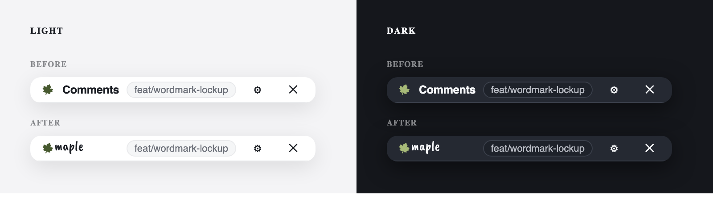

# The wordmark

Maple's mark is a leaf and the word `maple`, drawn together. Both are path
data in `packages/ui/src/marks/`, and neither is a font at runtime.

There are two leaves and they are not interchangeable. `leaf.ts` is the
comment mark: one silhouette in one colour, because `marks/shape.ts` draws it
in four forms that all depend on that. `pixel-leaf.ts` is the brand mark, and
only the lockup draws it.

## Why a path and not a webfont

The overlay renders inside a shadow root. `@font-face` is a document-level
rule and does not apply inside one, so a webfont would have to be registered
against the host application's document — a network request the host did not
ask for, a name in its font registry, and a flash of unstyled wordmark while
it loads. The word is five glyphs and never changes. It is an asset.

This is the same bargain `leaf.ts` already makes, and its header says so.

## What it is drawn from

[Caveat Brush](https://fonts.google.com/specimen/Caveat+Brush), under the SIL
Open Font License 1.1, which permits outlining glyphs into artwork. The
outlines were taken at 0.003em tracking — the tracking chosen during the
lockup trials — and the result was translated so its bounding box is the ink
box. A view box carrying whitespace cannot be centred against anything.

To regenerate after a change to the word or the tracking:

```js
// opentype.js, against the Caveat Brush TTF
const path = font.getPath("maple", 0, 0, 100, { letterSpacing: 0.003 });
const box = path.getBoundingBox(); // then translate by -box.x1, -box.y1
```

`WORDMARK_VIEW_BOX` is that box and `WORDMARK_RATIO` is its aspect, so a
caller sizing by height gets the width for free.

## In the island



## The pixel leaf

`PIXEL_LEAF_SHADES` in `packages/ui/src/marks/pixel-leaf.ts` is artwork: 443
cells in 33 colours, merged greedily into 263 rectangles and emitted darkest
first, one `<path>` per colour inside one `<svg>`. `shape-rendering:
crispEdges` is not optional. Without it the cells are smoothed into a blob at
24 pixels and into a poster at 1024, which is the whole drawing gone.

**Its 33 colours are its own and are not tokens.** They do not resolve against
the theme, they do not change between light and dark, and they are not a
second accent. Read as a ramp they run from `oklch(0.31 0.064 119)` to
`oklch(0.78 0.151 108)`: the accent's own hue at the dark end, opening toward
the yellow end as it lightens. That is the accent's hue opened, not a second
one, which is why the drawing sits beside accent-coloured chrome without
arguing with it.

**It cannot be the comment mark.** Three signals never compete for the same
pixel in `marks/index.ts`: a fill clipped at a waterline is how far through
its life a comment is, the outline path filled rather than the silhouette
stroked is how sure the anchor is, and `currentColor` is its status. A drawing
in 33 fixed colours collapses all three: it cannot be recoloured, and clipped
at a waterline it reads as nothing.

## The lockup

`Wordmark` in `packages/ui/src/island/wordmark.ts` is the composite, and it is
a composite rather than two parts because the two are only correct together.

The leaf in the lockup is the pixel leaf, and the lockup is the only thing
that draws it. All three numbers below were re-measured against it: the leaf
it replaced was a 64-unit drawing rotated inside a 78-unit box, so only 0.82
of its height was ever ink, and none of the old numbers survived a drawing
that fills 0.93 of its box.

- **One number sizes it.** `size` is the leaf's edge in pixels. The word is
  `WORDMARK_WORD_SCALE` (0.90) of it: at parity the leaf overpowers a
  lowercase word whose x-height is half its own box, and at the old 0.86 the
  word reads short beside a leaf with this much ink in it.
- **A gap of 0.2 of the leaf's edge.** The old leaf's own tips carried the air
  between the two and the rule was no gap at all. This one ends where its box
  ends, so butted against the word it reads as a collision.
- **The word rides up by both centres of mass.** The rise is
  `(0.5 - LEAF_MASS) * size + (WORD_MASS - 0.5) * height`, where `LEAF_MASS`
  is 13.42 of the leaf's 28 and `WORD_MASS` is 0.5076 of the word's 94.22.
  It changed direction: the old leaf's mass sat below its box centre because
  the stem was the long end, this one's sits a little above it, and the word's
  sits a little below its own. Both halves are the correction, so both are in
  it. `wordmark.ts` computes it; nothing in `css.ts` restates it.

## In the README

`docs/assets/wordmark.svg` and `wordmark-dark.svg` are the same drawing with
the token colours resolved to hex, paired in a `<picture>`. GitHub strips
inline SVG from Markdown and does not evaluate `oklch()` in a linked image, so
the two files exist rather than one that adapts.

|       | leaf                      | word                  |
| ----- | ------------------------- | --------------------- |
| light | `#465a2b` (`--mk-accent`) | `#1a1d23` (`--mk-fg`) |
| dark  | `#a6bb72` (`--mk-accent`) | `#f6f7f9` (`--mk-fg`) |

Regenerate them from the token values in `packages/ui/src/tokens.ts` whenever
those change; nothing checks that they still agree.

## On a pull request

Every body `exportMarkdown` writes is assembled in the same order: one line
saying who wrote the comments and what wrote them down, the table, a line
saying what the fence is, the fence, then a rule above the footer.

````
Comment written by Ada Lovelace via ⟨wordmark⟩:

| # | Where | Comment | Viewport |
…

The full comment details in markdown, to copy into an agent:

```maple
…
```

---

⟨preview.example.com @ a1b2c3d⟩ · powered by Maple
````

The chrome is not optional and takes no argument. A comment Maple posts is the
only place most people ever see the project, and a flag deciding whether it is
branded would be a flag nobody sets.

- **The wordmark is the same `<picture>` pair the README uses**, served from
  `raw.githubusercontent.com` on `main`, which is why moving or renaming
  `docs/assets/wordmark.svg` breaks the mark on every comment already posted.
  It is emitted on one line: a blank line inside an HTML block ends the block,
  and the rest would render as literal markup.
- **It sits in the sentence rather than above it.** A banner on its own line
  reads as a header on the reviewer's comment, which is whose comment it is
  not. In the sentence it reads as the byline it is.
- **`<sub>` is how it is lowered**, because GitHub's sanitiser drops `style`
  from a comment body and replaces it with its own. The word's baseline sits
  two thirds down the image, so left on the text baseline the mark reads about
  7 pixels high, and `align="middle"` overcorrects by the same amount: it puts
  the word on the baseline and the leaf, which carries the eye, below the
  line. `<sub>` lowers it by about 3 and is the half that looks level.
- **The author line is derived, never stored.** It names each distinct
  `comment.author.name` once, in first-appearance order. A set whose authors
  are all blank says `collected via` instead, so the mark never drops out.
- **The footer stamps the preview.** The host of `context.url` and the first
  seven of `commit`, from the first comment in the set: a reviewer with three
  previews open cannot tell them apart from the table. A URL that will not
  parse costs the stamp and nothing else.
- **The fence keeps its own budget.** `bytes` and `reduced` describe the fence
  alone, so the chrome cannot push a comment into a reduction.

## The App's logo

`docs/assets/app-logo.png` is the avatar both GitHub Apps wear: the solid leaf
filling a transparent square edge to edge, tilted its own 20 degrees, outlined
in cream, with a lowercase `m` in Caveat Brush cut out of it in the same cream.
The outline is what holds the leaf off a dark surface behind it, and it
disappears harmlessly into a cream badge plate. Lowercase,
because the wordmark's word is lowercase and a capital reads as a different
mark; cut out rather than laid on, because at 20 pixels in a checks list the
counter is the only thing that says the leaf is a letter at all.

It is a manual upload under **Display information** — GitHub has no manifest
field for a logo and no REST endpoint for an App's avatar — so the
`setup-maple-org` skill asks for it at the step where a person is already on
that page. The badge background beside it is `#fdf8e8`, the cream, and not the
accent: GitHub fills a circle behind the square logo with that colour, so the
accent would be the leaf's own green and the leaf would vanish into its plate.
At sixteen pixels, in the corner of a reviewer's avatar, that is the whole
mark gone.

`leafSize` is a percentage of the **ink**, not of the view box: the leaf's box
is padded so its tips cannot clip when it rotates, and the ink inside it is
only about 68% of that box, by a different amount at every tilt. The lab
measures the ink and fits to it, so `100` means the leaf touches all four
edges and `92` used to mean 63%. The `m` is anchored on the leaf's centre of
**mass** rather than on its box, because the stem hangs off one corner: a
letter centred in the box reads off centre in the leaf, which is the only
centre a reader sees. `mX` and `mY` are offsets from that, and both are zero.

Regenerate it from `tools/logo-lab/index.html`, which draws `LEAF_SOLID` and
the letter onto a canvas at any size and previews the result down to 20
pixels. Open it, load the **Cut-out** preset, and these are the settings the
file was rendered at, at 1024:

```json
{
  "leafStyle": "solid",
  "leafColor": "#465a2b",
  "leafSize": 100,
  "leafTilt": 20,
  "strokeWidth": 3.5,
  "strokeColor": "#fdf8e8",
  "mColor": "#fdf8e8",
  "mSize": 34,
  "mX": 0,
  "mY": 0,
  "mTilt": 0,
  "mCase": "m",
  "bgAlpha": 0
}
```

```

```
